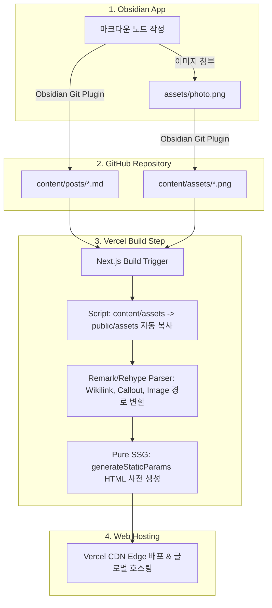

# 📝 Obsidian 마크다운 기반 커스텀 블로그 아키텍처 & 개발 분석서

이 문서는 **Obsidian(옵시디언)** 노트를 **GitHub 저장소**에 올리고, **Next.js + Vercel** 파이프라인을 통해 정적 웹사이트(HTML)로 자동 변환 및 호스팅하는 시스템의 분석 및 설계 문서입니다.

---

## 📍 1. 프로젝트 목표 & 전체 아키텍처

### 🎯 핵심 목표
1. **옵시디언 편의성 유지**: 옵시디언에서 작성한 `.md` 노트 및 이미지를 수정 없이 GitHub 저장소에 Push하는 것만으로 블로그 업데이트.
2. **Vercel 완전 배포 안정성**: 런타임 파일 접근 에러가 발생하지 않는 Pure SSG(Static Site Generation) 방식 연동.
3. **무료 이미지 호스팅**: 별도 이미지 서버 없이 GitHub 저장소 내 이미지 폴더를 웹 자원으로 자동 파싱 및 제공.
4. **Obsidian 고유 문법 지원**: Wikilink(`[[문서]]`), Callout(`> [!note]`), Frontmatter YAML, 수식, 코드 하이라이트 완벽 지원.

### 🔄 전체 데이터 흐름 (Workflow)



---

## 🛡️ 2. Vercel + Next.js 배포 트러블슈팅 사전 대책

Next.js 앱을 Vercel에 배포할 때 자주 발생하는 빌드 실패 및 런타임 오류 방지책입니다.

| 문제 유형 | 원인 | **기술적 해결 대책** |
| :--- | :--- | :--- |
| **Serverless `fs` 접근 에러** | Vercel 런타임 환경에서 로컬 파일 시스템 읽기 시도 | **Pure SSG 모드 적용**.<br>`export const dynamic = 'force-static'` 및 `generateStaticParams()`를 적용해 모든 마크다운을 빌드 타임에 HTML로 완전 렌더링. |
| **Frontmatter / 파싱 문법 오류** | 마크다운 내 비표준 문법이나 메타데이터 누락 | **Safe Parser (오류 래퍼 함수)** 적용.<br>Frontmatter 파싱 실패 시 기본값(생성일, 제목 등)을 제공하고 빌드 중단을 방지. |
| **상대 경로 이미지 깨짐** | 옵시디언의 `![[photo.png]]` 링크가 웹 경로와 불일치 | **Custom Remark Image Plugin** 적용.<br>옵시디언 이미지 표기를 웹 접근 가능 경로(`/assets/photo.png`)로 자동 변환. |
| **동적 경로 404 발생** | 새로운 글 작성 시 Static Fallback 미비 | `export const dynamicParams = false` 설정 및 정적 파라미터 사전 생성 처리. |

---

## 🖼️ 3. GitHub 기반 이미지 저장 및 처리 구조

별도의 Cloud storage (S3, Cloudinary 등) 없이 **GitHub 저장소 하나로 이미지까지 자동 처리**합니다.

1. **Obsidian 설정**:
   - `Settings` $\rightarrow$ `Files and links` $\rightarrow$ `Default location for new attachments`를 `In subfolder under current folder` (폴더명: `assets`)로 지정.
2. **저장소 파일 구조**:
   - `content/posts/my-first-post.md`
   - `content/assets/my-image.png`
3. **Next.js 파이프라인**:
   - 빌드 시작 시 `scripts/copy-assets.mjs`가 실행되어 `content/assets`의 파일들을 `public/assets` 폴더로 자동 복사.
   - 마크다운 파서가 `![[my-image.png]]` 및 ``를 HTML ``로 변환.

---

## 🛠️ 4. 기술 스택 및 파서 구성

* **Core Framework**: Next.js 14+ (App Router, TypeScript)
* **Styling**: Vanilla CSS (CSS Modules) - Modern Dark/Light Theme & Glassmorphism
* **Markdown Pipeline**:
  * `gray-matter`: YAML 메타데이터 안전 추출
  * `remark-gfm`: GitHub Flavored Markdown (테이블, 체크박스 등)
  * `remark-math` & `rehype-katex`: LaTeX 수식 지원
  * **Custom Obsidian Plugin**: `[[Wikilink]]` $\rightarrow$ `/posts/slug` 변환, Callout(`> [!note]`) $\rightarrow$ Callout Component 변환
  * `rehype-pretty-code` / `shiki`: 고성능 구문 강조 (Code Highlighting)
  * `rehype-slug`, `rehype-autolink-headings`: 목차(TOC) 앵커 자동 생성

---

## 📂 5. 디렉토리 구조 제안

```text
blodoc/
├── docs/                     <-- [현재 폴더] 분석 및 문서화 자료
│   └── blog-architecture-analysis.md
├── content/                  <-- Obsidian 연동 마크다운 및 이미지 저장소
│   ├── assets/               <-- Obsidian 첨부 이미지
│   ├── posts/                <-- 마크다운 포스트 파일들 (원형 유지를 위한 사용자 전용)
│   ├── comments/             <-- 수집 댓글 마크다운 노트 (target: "[[slug]]" 위키링크 연동)
│   └── analytics/            <-- 일일 방문자/좋아요 통합 요약 마크다운 노트
├── scripts/
│   └── copy-assets.mjs       <-- 빌드 타임 이미지 자동 복사 스크립트
├── public/
│   └── assets/               <-- 복사 완료된 호스팅용 이미지
├── src/
│   ├── app/
│   │   ├── layout.tsx        <-- 글로벌 레이아웃 (헤더, 푸터, 다크모드)
│   │   ├── page.tsx          <-- 메인 블로그 포스트 리스트
│   │   └── posts/[slug]/page.tsx <-- 포스트 상세 보기 (SSG)
│   ├── components/
│   │   ├── Header.tsx
│   │   ├── TOC.tsx           <-- Floating Table of Contents
│   │   ├── Callout.tsx       <-- Obsidian Callout UI
│   │   └── ThemeToggle.tsx   <-- 다크/라이트 모드 스위치
│   ├── lib/
│   │   ├── posts.ts          <-- 마크다운 수집 & Safe Parsing SSG 함수
│   │   └── obsidian.ts       <-- 옵시디언 전용 커스텀 파서
│   └── styles/
│       ├── globals.css       <-- 디자인 토큰 및 다크모드 변수
│       └── markdown.css      <-- 본문 읽기 최적화 가독성 스타일
├── package.json
└── tsconfig.json
```

---

## 📋 6. 단계별 구현 마일스톤

1. **Step 1: 프로젝트 환경 셋업**
   - Next.js 14 App Router (TypeScript) 기반 초기화 및 기본 디자인 토큰 CSS 구축.
2. **Step 2: 마크다운 & 이미지 파이프라인 수립**
   - `scripts/copy-assets.mjs` 구현 및 `content/` 디렉토리 파싱 로직 (`lib/posts.ts`) 구축.
3. **Step 3: Obsidian 전용 커스텀 파서 구현**
   - Wikilink, Callout, Frontmatter Safe Parser, Code Highlighting 적용.
4. **Step 4: UI/UX & 디자인 구현**
   - 다크/라이트 모드, 반응형 포스트 레이아웃, Floating TOC, 카테고리/태그 필터링.
5. **Step 5: Vercel 배포 및 Obsidian Git 연동 검증**
   - Pure SSG 빌드 확인, Vercel 배포 및 Obsidian 노트 푸시 시 자동 반영 테스트.
