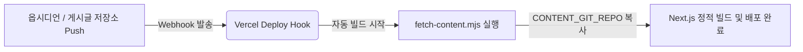

# 🔄 GitHub 저장소 - Vercel 자동 동기화(Deploy Hook) 연동 가이드

이 가이드는 옵시디언 마크다운이 들어있는 **원격 게시글 Git 저장소**에 새 글이 업로드(Push)될 때, Vercel에 배포된 블로그가 **자동으로 다시 빌드되어 게시글이 동기화**되도록 설정하는 방법을 설명합니다.

---

## 🛠️ 전체 동작 구조



1. **게시글 저장소**에 새로운 커밋이 Push되면, GitHub가 설정된 Vercel Webhook으로 알림을 보냅니다.
2. **Vercel**은 알림을 받아 블로그 사이트 재빌드(Redeploy)를 시작합니다.
3. 빌드 타임에 [fetch-content.mjs](file:///Users/mypc/projects/blodoc/scripts/fetch-content.mjs)가 실행되며 최신 게시글 데이터를 불러와 정적 HTML을 생성(Pure SSG)합니다.

---

## 📋 단계별 연동 방법

### 1단계. Vercel에서 Deploy Hook 생성하기
1. [Vercel Dashboard](https://vercel.com/dashboard)에 접속하여 본 블로그 프로젝트를 선택합니다.
2. 상단 탭에서 **Settings** -> 좌측 메뉴에서 **Git** 항목으로 이동합니다.
3. 스크롤을 아래로 내려 **Deploy Hooks** 섹션을 찾습니다.
4. 다음과 같이 입력하여 Hook을 생성합니다:
   - **Hook Name**: `github-content-sync` (또는 자유로운 이름)
   - **Git Branch Name**: 배포 대상 브랜치 (보통 `main` 또는 `master`)
5. 생성된 **Deploy Hook URL**을 복사합니다. 
   *(예: `https://api.vercel.com/v1/integrations/deploy/prj_xxxx/xxxx`)*

> [!IMPORTANT]
> **캐시 방지 파라미터 필수 추가**
> Vercel은 빌드 속도 단축을 위해 빌드 캐시를 적극적으로 사용합니다. 마크다운 파일만 변경된 상태에서 웹훅이 호출되면, Next.js의 빌드 캐시로 인해 변경된 콘텐츠가 정적 페이지(SSG)에 반영되지 않을 수 있습니다.
> 이를 방지하려면 복사한 URL 끝에 반드시 `?buildCache=false` 쿼리 파라미터를 덧붙여 사용해야 합니다.
> * **수정된 URL 예시:** `https://api.vercel.com/v1/integrations/deploy/prj_xxxx/xxxx?buildCache=false`

### 2단계. GitHub 게시글 저장소에 Webhook 설정하기
1. 작성한 옵시디언 마크다운 노트가 업로드된 **GitHub 게시글 저장소**로 이동합니다.
2. 저장소 상단의 **Settings** -> 좌측 메뉴에서 **Webhooks**로 이동합니다.
3. 우측 상단의 **Add webhook** 버튼을 클릭합니다.
4. 아래 설정을 입력합니다:
   - **Payload URL**: 1단계에서 복사한 Vercel Deploy Hook URL 끝에 `?buildCache=false`를 추가하여 붙여넣습니다.
     *(예: `https://api.vercel.com/v1/integrations/deploy/prj_xxxx/xxxx?buildCache=false`)*
   - **Content type**: `application/json`으로 선택합니다.
   - **Secret**: 비워둡니다.
   - **Which events would you like to trigger this webhook?**: `Just the push event.`를 선택합니다.
5. **Add webhook** 버튼을 클릭하여 저장합니다.

### 3단계. Vercel 환경 변수 검증 (`CONTENT_GIT_REPO`)
빌드 단계에서 원격 저장소의 콘텐츠를 정상적으로 긁어올 수 있도록 Vercel 환경변수 세팅이 올바른지 확인합니다.

1. Vercel 프로젝트의 **Settings** -> **Environment Variables**로 이동합니다.
2. `CONTENT_GIT_REPO` 키에 게시글 저장소 주소가 등록되어 있어야 합니다.
   * **Public 저장소인 경우**:
     ```env
     CONTENT_GIT_REPO=https://github.com/사용자명/게시글-저장소-이름.git
     ```
   * **Private 저장소인 경우** (인증 토큰 필요):
     ```env
     CONTENT_GIT_REPO=https://<GITHUB_PAT_TOKEN>@github.com/사용자명/게시글-저장소-이름.git
     ```
     > 💡 **PAT(Personal Access Token) 발급 방법**:
     > GitHub 우측 상단 프로필 클릭 -> **Settings** -> **Developer settings** -> **Personal Access Tokens (classic)**에서 `repo` 읽기 권한을 부여한 토큰을 발급하여 URL 구조 내 `<GITHUB_PAT_TOKEN>` 자리에 삽입합니다.

---

## 🧪 테스트 방법
1. 옵시디언 혹은 로컬 에디터에서 게시글 저장소에 간단한 테스트용 마크다운 파일을 하나 추가하거나 수정합니다.
2. 게시글 저장소에 `git push`를 수행합니다.
3. Vercel Dashboard의 **Deployments** 탭으로 이동하여 새 배포 빌드가 자동으로 트리거되고 완료되는지 확인합니다.
4. 블로그 사이트에 접속하여 새로 추가된 게시글이 잘 반영되었는지 확인합니다.
